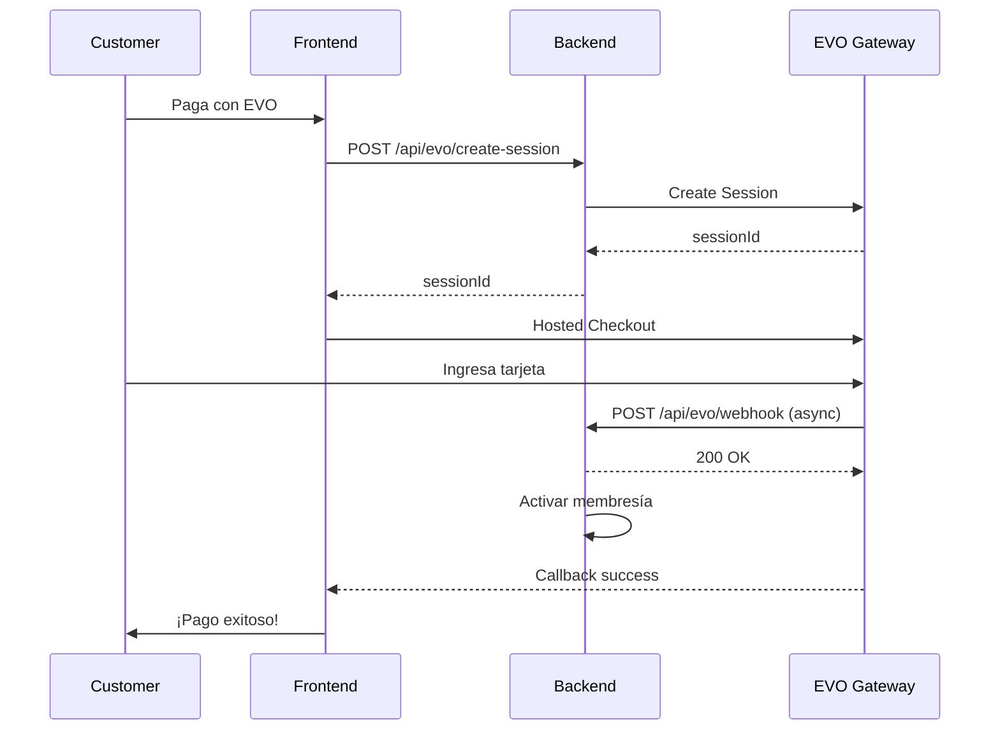

# Configuración de Webhook EVO Payments

## 📝 Pasos para Configurar el Webhook en EVO Portal

### 1. Accede al Merchant Administration Portal
- URL: Tu portal de administración de EVO/Mastercard Gateway
- Login con tus credenciales de merchant

### 2. Navega a Webhook Notifications
- Busca la sección **"Webhook Notifications"**
- Haz clic en **"Enable"** para activar las notificaciones

### 3. Configura la URL de Notificación

**Para PRODUCCIÓN:**
```
https://pagos.fitsanctuary.mx/api/evo/webhook
```

**Para PRUEBAS/TEST:**
```
https://tu-deployment-test.vercel.app/api/evo/webhook
```

### 4. Selecciona el Formato de API
- Marca la opción: **JSON/REST** ✅

### 5. Genera y Guarda el Notification Secret

1. Haz clic en **"Generate New Secret"**
2. **COPIA EL SECRET** que se genera (ejemplo: `a1b2c3d4e5f6...`)
3. **IMPORTANTE:** Guárdalo inmediatamente, no podrás verlo después

### 6. Haz clic en **"Save"**

---

## 🔐 Configurar el Secret en Vercel

### En el Dashboard de Vercel:

1. Ve a tu proyecto: **fit-sanctuary-pagos**
2. Click en **"Settings"** → **"Environment Variables"**
3. Agrega una nueva variable:

```
Name:  EVO_WEBHOOK_SECRET
Value: [pega el secret generado en el paso 5]
```

4. Selecciona los ambientes:
   - ✅ Production
   - ✅ Preview
   - ✅ Development

5. Click en **"Save"**
6. **Redeploy** el proyecto para aplicar la nueva variable

---

## ✅ Verificar que Funciona

### Endpoint del Webhook:
```
POST https://pagos.fitsanctuary.mx/api/evo/webhook
```

### Headers que EVO enviará:
```json
{
  "Content-Type": "application/json",
  "X-Notification-Secret": "tu_secret_aqui"
}
```

### Ejemplo de Payload que recibirás:
```json
{
  "order": {
    "id": "ORD-1234567890",
    "amount": "579.00",
    "currency": "MXN",
    "status": "CAPTURED"
  },
  "transaction": {
    "id": "TXN-abc123",
    "type": "PAYMENT",
    "amount": "579.00"
  },
  "result": "SUCCESS"
}
```

### Respuesta que tu servidor debe dar:
```json
{
  "received": true,
  "orderId": "ORD-1234567890",
  "timestamp": "2026-02-06T12:34:56.789Z"
}
```

---

## 🧪 Probar el Webhook (Manual)

Puedes simular un webhook desde tu terminal:

```bash
curl -X POST https://pagos.fitsanctuary.mx/api/evo/webhook \
  -H "Content-Type: application/json" \
  -H "X-Notification-Secret: TU_SECRET_AQUI" \
  -d '{
    "order": {
      "id": "TEST-ORDER-123",
      "amount": "100.00",
      "currency": "MXN",
      "status": "CAPTURED"
    },
    "transaction": {
      "id": "TEST-TXN-456"
    },
    "result": "SUCCESS"
  }'
```

**Respuesta esperada:**
```json
{
  "received": true,
  "orderId": "TEST-ORDER-123",
  "timestamp": "2026-02-06T..."
}
```

---

## 📋 Logs del Webhook

Los logs aparecerán en Vercel:

```
📥 EVO Webhook recibido: { headers: {...}, body: {...} }
🔔 EVO Webhook: Orden ORD-123, Estado: CAPTURED, Resultado: SUCCESS
✅ Pago exitoso para orden ORD-123: $579.00 MXN
```

---

## ⚠️ Troubleshooting

### Error: "Invalid notification secret"
- Verifica que `EVO_WEBHOOK_SECRET` esté configurado en Vercel
- Asegúrate de haber redeployado después de agregar la variable
- El secret debe coincidir exactamente con el generado en EVO Portal

### No recibo webhooks
1. Verifica que la URL sea accesible públicamente
2. Confirma que el webhook está **Enabled** en EVO Portal
3. Revisa que no haya typos en la URL
4. Checa los logs de Vercel por errores

### Webhooks duplicados
- Es normal que EVO reintente si no recibe 200 OK
- El endpoint ya maneja esto devolviendo 200 siempre

---

## 🔄 Flujo Completo



---

## 📚 Referencias

- [EVO Payments Documentation](https://docs.evopayments.com)
- [Mastercard Gateway API Reference](https://gateway.mastercard.com/api/documentation)
- [Webhook Best Practices](https://docs.evopayments.com/webhooks)

---

**✅ Configuración completada cuando:**
1. ✅ Webhook habilitado en EVO Portal
2. ✅ URL configurada: `https://pagos.fitsanctuary.mx/api/evo/webhook`
3. ✅ Secret generado y guardado
4. ✅ Variable `EVO_WEBHOOK_SECRET` en Vercel
5. ✅ Proyecto redeployado
6. ✅ Test manual exitoso
